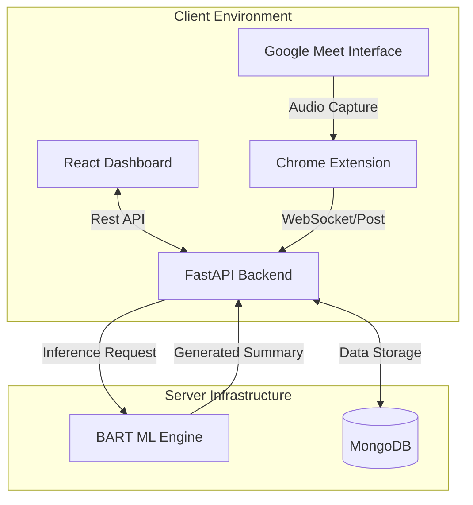

# MeetingMind AI

[Live Demo](https://meetingmind-ai-qw6i.vercel.app/)

MeetingMind AI is an advanced, privacy-centric meeting assistant designed to automate the capture, transcription, and summarization of Google Meet sessions. By leveraging a self-hosted, fine-tuned BART model, MeetingMind AI ensures that sensitive meeting data remains within a controlled environment, eliminating reliance on third-party Large Language Model (LLM) APIs.

## Core Capabilities

- **Real-time Transcription**: Seamlessly captures audio streams directly from Google Meet using the Web Speech API.
- **Local AI Summarization**: Generates structured summaries, including actionable insights and key decisions, using a locally hosted machine learning pipeline.
- **Privacy-First Architecture**: All data processing and summarization are performed on-device or on self-hosted infrastructure.
- **Chrome Extension Integration**: A Manifest V3-compliant extension provides an intuitive interface for managing sessions within the browser.
- **Advanced Dashboard**: A high-performance web interface built with React and Three.js for comprehensive management of meeting records.

## Why MeetingMind?

MeetingMind addresses the critical gap between productivity and data privacy. While conventional meeting assistants rely on external cloud providers, MeetingMind offers:

- **Zero Data Leakage**: Your conversations never leave your infrastructure.
- **High Performance**: Optimized BART model provides near-instant summaries.
- **Seamless Workflow**: Integrated directly into the Google Meet experience.
- **Customizable ML**: The fine-tuned BART model is specifically optimized for multi-speaker dialogue.

## Technical Architecture

The system is composed of three primary layers, orchestrated to provide a seamless flow from audio capture to AI-driven insights:



1.  **Frontend (Dashboard)**: A sophisticated web application utilizing Vite, React, and GSAP for fluid interactions, with Three.js for data visualization components.
2.  **Backend (API & Inference)**: A FastAPI-based service that handles session management, database interactions with MongoDB, and coordinates the ML inference engine.
3.  **Chrome Extension**: A secure browser utility that serves as the bridge between the Google Meet interface and the backend services.

## Technology Stack

- **Frontend**: React, Vite, Three.js, React Three Fiber, GSAP.
- **Backend**: Python, FastAPI, MongoDB.
- **Machine Learning**: PyTorch, Hugging Face Transformers (BART-Large-CNN).
- **Extension**: JavaScript (Manifest V3).

## Installation and Deployment

### 1. Backend Configuration

The backend requires Python 3.9+ and a running MongoDB instance.

```bash
cd backend
python -m venv venv
source venv/activate  # On Windows: venv\Scripts\activate
pip install -r requirements.txt
cp .env.example .env
# Configure environment variables in .env
uvicorn main:app --reload --port 8000
```

### 2. Chrome Extension Setup

1. Build the extension popup:
   ```bash
   cd extension/popup
   npm install
   npm run build
   ```
2. Load the extension in Chrome:
   - Navigate to `chrome://extensions/`.
   - Enable Developer Mode.
   - Select "Load unpacked" and choose the `extension/` directory.

### 3. Dashboard Deployment

```bash
cd website
npm install
npm run dev
```

## Machine Learning Pipeline

The summarization engine utilizes a fine-tuned version of `facebook/bart-large-cnn`. The model was trained on meeting-specific dialogue datasets to optimize for multi-speaker coherence and context retention.

To execute the fine-tuning script:
```bash
cd ml
python fine_tune.py --model_name facebook/bart-large-cnn --output_dir ../checkpoints/bart-meeting/final
```

## License

This project is licensed under the MIT License.

---

Developed by [Dhanvin](https://github.com/Dhanvin1520).
